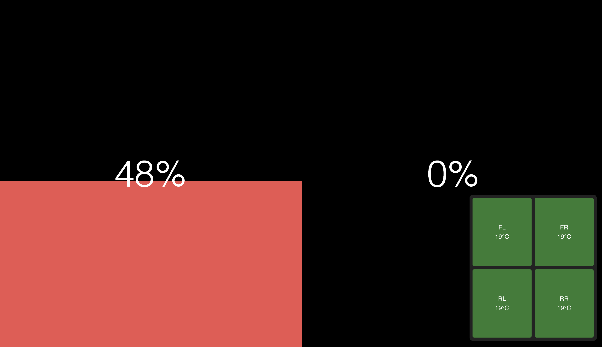

## GT7 Live HUD Dashboard

A HUD dashboard for any GT7 players. Displaying useful information including brake pressure, throttle position and tyres temperature.

## Demo


## Prerequisite
Tested with below dependencies version
- Node 20
- Go 1.23

## Usage
```
make install
make start-prod
```

## Tech stack
- Go
- Vite react

## Development with hot-reload
```
make install
make start-dev
```

## Thank you
- [snipem/go-gt7-telemetry](https://github.com/snipem/go-gt7-telemetry)